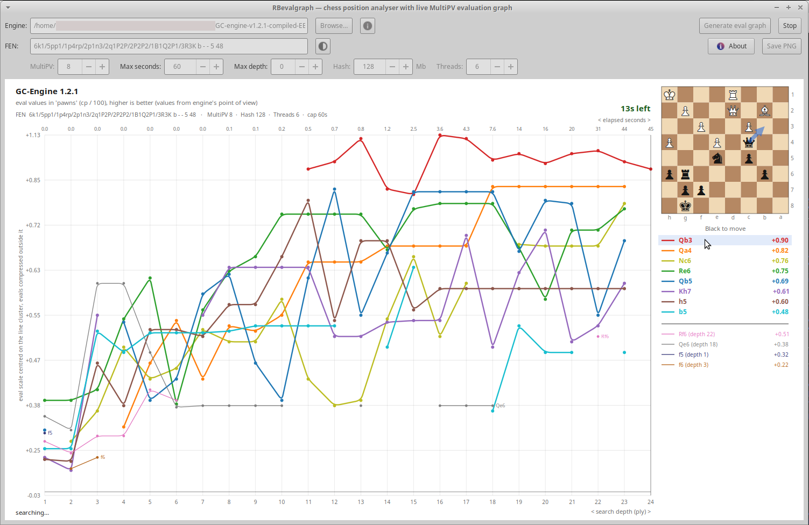

# RBevalgraph

**Chess position analyser with a live MultiPV evaluation graph.**

**Contents**

- [Why](#why)
- [What it does](#what-it-does)
- [Requirements](#requirements)
- [Download (Linux)](#download-linux)
- [Building (Linux)](#building-linux)
- [Building on Windows and macOS](#building-on-windows-and-macos)
- [Using it](#using-it)
- [About MultiPV](#about-multipv)
- [Reading the graph](#reading-the-graph)
- [The diagram and the Chess Alpha font](#the-diagram-and-the-chess-alpha-font)
- [Engine detection](#engine-detection)
- [config.yaml](#configyaml)
- [Output files](#output-files)
- [Tools](#tools)
- [Files in this repository](#files-in-this-repository)
- [Credits](#credits)
- [Licence](#licence)

Enter any chess position — RBevalgraph shows how each candidate move's evaluation changed with rising depth, using MultiPV.

RBevalgraph is a small desktop program (Go + GTK4) that runs a UCI chess engine on one position and plots, *while the search runs*, a coloured line for every move the engine ever put in its MultiPV list. You see which moves the engine liked at depth 8, which ones it dropped at depth 14, and which one sneaked up from nowhere at depth 20.



A one-minute search, live (no sound):

https://github.com/user-attachments/assets/67c67294-b561-4a54-b412-08b4191b0849

More examples, with their graphs and search logs, are in [examples/](examples/).

---

## Why

An engine's final `bestmove` hides its whole search history. When you study engine behaviour — your own engine against others, or one engine on a tricky position — the interesting part is *how* the evaluation of each candidate fluctuates as depth rises: horizon effects, late discoveries, moves that look good until they don't. RBevalgraph makes that visible in one picture, and lets you save it.

It grew out of a Python command-line script (included, see [Tools](#tools)) that did the same job but had no live output.

---

## What it does

From the INFO pane of the program:

**Function** — RBevalgraph runs a UCI chess engine on any position and shows data of the changing candidate moves. While the MultiPV search runs, colored lines are plotted for all moves (ever considered by the engine), reflecting the evaluation fluctuations as depth rises.

**Usage** — Browse to a UCI engine, paste a FEN, set your options and press 'Generate eval graph'. After the process ends, or is stopped, you can save the result as a PNG image. Many elements have a tooltip, hover for info. You can also manually enter values.

**Saving the graph** — What you see is what you save : resizing the window results in resizing the graph and the saved PNG has same aspect ratio. The right info column keeps its width. The file name is proposed for you, mentioning the engine name and your main settings.

**Configuration** — Options are set automatically according to engine features, or grayed-out when not existing. Everything you set is instantly written to a file called 'config.yaml', created in same folder as your RBevalgraph binary. This configuration file is optional, it's read when the program starts : your last settings are kept.

---

## Requirements

- **Linux with GTK4.** Developed and used on Xubuntu 24.04 (Xfce, X11). Other desktops with GTK4 should work. Windows and macOS users can build it themselves, see [Building on Windows and macOS](#building-on-windows-and-macos).
- **Go** 1.21 or newer, with **cgo** (the default when a C compiler is present).
- **GTK4 development files** and a C toolchain. On Ubuntu / Debian:

  ```
  sudo apt install golang libgtk-4-dev build-essential pkg-config
  ```

- **A UCI chess engine** — any binary that speaks UCI (Stockfish, Obsidian, Ember, RBp4wn, …). XBoard/CECP engines are recognised but cannot be used, see [Engine detection](#engine-detection).
- *Optional:* the **Chess Alpha** font for nicer pieces, see [The diagram and the Chess Alpha font](#the-diagram-and-the-chess-alpha-font).

Go dependencies (fetched automatically by `go mod tidy`):

| Module | Used for |
|---|---|
| `github.com/diamondburned/gotk4/pkg` **v0.3.1** | GTK4, GDK, GLib and Cairo bindings |
| `github.com/notnil/chess` | FEN validation and SAN move names |
| `gopkg.in/yaml.v3` | reading and writing `config.yaml` |

> **Keep gotk4 at v0.3.1.** Version 0.4.x needs GLib 2.82 or newer; Ubuntu 24.04 ships GLib 2.80, and the build then fails with a wall of `could not determine what C.g_get_monotonic_time_ns refers to`. The reason is also written in a comment in `go.mod` — leave it there.

---

## Download (Linux)

A ready-made Linux binary is attached to each release on the [Releases page](https://github.com/tissatussa/RBevalgraph/releases), as `rbevalgraph-v1.0-linux-amd64.tar.gz`.

- It is built on Xubuntu 24.04 for 64-bit Intel/AMD processors.
- It needs the GTK4 runtime (`libgtk-4-1`), which a GTK4 desktop already has, and a glibc at least as new as Ubuntu 24.04's. On older distributions, build from source instead.

```
tar xzf rbevalgraph-v1.0-linux-amd64.tar.gz
./rbevalgraph
```

The source code of each release is on the same page, as "Source code (zip)" and "Source code (tar.gz)".

---

## Building (Linux)

```
git clone https://github.com/tissatussa/RBevalgraph.git
cd RBevalgraph
go mod tidy
go build -o rbevalgraph .
./rbevalgraph
```

The **first** build is slow — compiling the GTK4 bindings can take several minutes and needs a fair amount of RAM. Later builds are quick, because Go caches the compiled bindings.

The whole program is one file, `main.go`, on purpose: you build it with `go build` and nothing else. The comments in `main.go` explain the details; [ARCHITECTURE.md](ARCHITECTURE.md) gives the map.

---

## Building on Windows and macOS

The code has no Linux-only parts, and the GTK4 bindings support both systems, so RBevalgraph should build there too. **This has not been tested by the author yet** — reports are welcome in the Issues.

The package lists below follow the instructions of the GTK4 bindings ([gotk4-examples](https://github.com/diamondburned/gotk4-examples)). Go 1.21 or newer is needed. The gotk4 version pinned in `go.mod` (v0.3.1) is kept for Ubuntu 24.04; newer GTK versions should still work with it.

### Windows (MSYS2)

1. Install [MSYS2](https://www.msys2.org).
2. Open the **MSYS2 MINGW64** shell from the Start menu. Do all following steps in that shell.
3. Install the compiler, GTK4, Go and git:

   ```
   pacman -S mingw-w64-x86_64-toolchain mingw-w64-x86_64-gtk4 mingw-w64-x86_64-gobject-introspection mingw-w64-x86_64-go git
   ```

4. Build:

   ```
   git clone https://github.com/tissatussa/RBevalgraph.git
   cd RBevalgraph
   go mod tidy
   go build -ldflags "-H=windowsgui" -o rbevalgraph.exe .
   ./rbevalgraph.exe
   ```

   `-H=windowsgui` keeps a console window from opening next to the program.

`rbevalgraph.exe` needs the GTK4 DLLs of MSYS2. It runs from the MINGW64 shell; to start it from Explorer, add `C:\msys64\mingw64\bin` to your Windows `PATH`. For the Chess Alpha font, right-click `fonts\chess.ttf` and choose **Install**.

### macOS (Homebrew)

1. Install [Homebrew](https://brew.sh).
2. Install GTK4, Go and pkg-config:

   ```
   brew install go gtk4 gobject-introspection pkg-config
   ```

3. Build and run as on Linux:

   ```
   git clone https://github.com/tissatussa/RBevalgraph.git
   cd RBevalgraph
   go mod tidy
   go build -o rbevalgraph .
   ./rbevalgraph
   ```

For the Chess Alpha font, double-click `fonts/chess.ttf` and choose **Install Font**.

As on Linux, the first build takes several minutes. Use `go build -v` to see that it is making progress.

---

## Using it

1. **Engine** — type a path or press **Browse…** to pick a UCI engine binary. RBevalgraph asks the engine who it is and which options it has (see below). The **ⓘ** button beside it shows the engine's full answer.
2. **FEN** — paste a position. The field turns red while it cannot be parsed. A valid FEN shows its diagram at once.
3. **Settings** — MultiPV, max seconds, max depth, Hash and Threads. Fields the engine does not support are grayed out.
4. **Generate eval graph** — the search starts and the graph grows live. **Stop** ends it early; everything found so far stays.
5. **Save PNG** — write the graph as it stands.

The search stops at whichever limit comes first:

- **Max seconds** — wall-clock limit, whatever depth has been reached.
- **Max depth** — stop once this depth is complete for every candidate. `0` switches the depth limit off and lets the seconds decide.

---

## About MultiPV

### What it is

Normally a chess engine looks for **one** best move and reports one main line, its *principal variation* (PV). With the UCI option **MultiPV** set to N, the engine reports the **N best moves**, each with its own line and its own evaluation, at every depth. RBevalgraph draws one coloured line for each of them.

### What it costs

In general, an engine does this by searching its best move first, then searching again with that move excluded to find the second best, and so on. How exactly depends on the engine, but each extra line costs a good part of an extra search. So in the same time, a higher MultiPV reaches a **lower depth**. You can see this for yourself in RBevalgraph: run the same position for the same time with MultiPV 1 and with MultiPV 8, and compare the depth on the right end of the axis.

### Playing: leave it at 1

For games, MultiPV belongs at 1. Time spent on the second, third and further moves is time not spent on the move the engine will actually play, so the chosen move gets weaker. Stockfish's own documentation gives exactly this advice, and it applies to engines in general. So in a GUI such as CuteChess, which can set MultiPV for an engine, keep it at 1 for matches and tournaments.

MultiPV also does not show how the engine "thinks" during a game. With MultiPV 1, the engine only needs to prove that other moves are **worse** than its best one; it never works out how much worse. The exact values of lines 2 to N are extra work that only happens in MultiPV mode.

### Analysing: what MultiPV is for

For analysis, MultiPV is the tool: it shows which moves were candidates, how close they were, and how that changed with depth — which is exactly what RBevalgraph plots.

**MultiPV can find moves that MultiPV 1 misses.** Modern engines spend little effort on moves that look bad early on: they are searched less deep than the main line, or cut off entirely. That is a big part of their strength, but it can hide a move whose value only shows at high depth, such as a sacrifice that first loses material. With MultiPV N, the N best moves are each searched as a main line, at full depth. A "puzzle move" that looks like the 7th best at low depth gets that full treatment only if MultiPV is 7 or more — and then it may climb to first place, where with MultiPV 1 it would never have been looked at closely. That is why a solution sometimes only appears with MultiPV 10 or higher. How strong this effect is differs per engine, and it is not guaranteed.

**How far to trust lines 2 to N.** Line 1 is a normal search, only less deep than it would be in the same time with MultiPV 1. The other lines are searched with the knowledge gathered for the lines before them, and engines implement this with different care. Some report lines that are not in value order — example 2 in [examples/](examples/) shows this — and some are less precise for the lower lines. RBevalgraph always ranks by value, whatever the engine's own numbering.

### Choosing a value in RBevalgraph

- **3 to 6** gives a readable overview of the main candidates.
- **8 to 12** for puzzles and sharp positions, with more time to make up for the lower depth.
- To see how a particular move ranks, MultiPV must be at least its rank; moves that fall out of the list are shown thinner below the separator in the key column.
- To compare engines, give them the same MultiPV, time, Hash and Threads.
- With more than one thread, a search is not exactly repeatable: two runs of the same setup can differ a little.

---

## Reading the graph

- **Horizontal axis:** search depth. Under the axis, the elapsed seconds at each depth (`< elapsed seconds >`), and a countdown while the search runs.
- **Vertical axis:** the engine's evaluation in pawns (the engine's centipawns / 100), plotted as the engine reports it: from the engine's point of view, so higher is better for the side to move — also when Black is to move. A mate score is plotted at ±10 and labelled `#+n` / `#-n` in the key column.
- **The vertical scale is compressed.** Engine evaluations cluster: most candidates sit within a few centipawns of each other, while one line may wander far off. So the axis is centred on the cluster, linear near it and logarithmic beyond. The grid labels always show real values. When this compression is active, a note says so, upright along the left side of the eval labels.
- **Lines are corner-rounded, not smoothed.** A smoothing spline would overshoot between points and draw evaluations the engine never reported.
- **Equal values** at the same depth are fanned apart by a few pixels so no line hides behind another.
- **The big dot with a black ring** marks the engine's `bestmove`.

### The key column (right side)

Below the diagram, every move the engine considered is listed with its colour, its SAN name and its latest evaluation. There are two groups, separated by a thin rule:

- **Top group** — the moves present at the *last complete depth* (the deepest depth at which all MultiPV slots reported), sorted by evaluation. Thick lines, bold text.
- **The rest** — moves that were in the MultiPV list at some point but fell out of it. Thin lines, with `(depth n)` telling you at which depth they were last seen — their value belongs to that depth. Their names are also printed at the end of their line in the plot.

**Hover** over a move in the key column: an arrow shows that move on the diagram.

### Colours and their behaviour

A colour belongs to a **rank**, not to a move. The list runs warm to cool — **red, orange, dark yellow, green, dark blue, purple, brown, light blue, light pink**, then grey, indigo and further colours (18 in total, then they repeat).

So a move takes the colour of the place it holds *now*: when one move overtakes another, the two lines swap colours. The red line is always the current number one. This is deliberate — you read the graph by rank.

The palette is the `palette` variable in `main.go`, one line per colour.

---

## The diagram and the Chess Alpha font

The position is drawn in the top of the key column as soon as the FEN is valid, seen from the side to move. The **⇅** (toggle) button flips the board.

For the pieces, RBevalgraph prefers the **Chess Alpha** font by Eric Bentzen. If it is not installed, it falls back to the Unicode chess symbols of a common font (Noto Sans Symbols2, DejaVu Sans or FreeSerif), which every desktop has. So the font is a recommendation, not a requirement.

The font is included in this repository as `fonts/chess.ttf`, but it is **not embedded** in the program; it has to be installed on your machine:

```
mkdir -p ~/.local/share/fonts
cp fonts/chess.ttf ~/.local/share/fonts/
fc-cache -f
fc-list | grep -i "chess alpha"     # should print one line
```

Restart RBevalgraph afterwards.

**How the font is detected:** by its measurements, not by name. A real chess font draws one square per glyph — every character is exactly one em wide and has no descender. A text font that the system silently substitutes fails that test. This matters, because Chess Alpha puts the pieces on ordinary letters: without the check, a substituted font would print `k q r` on the squares instead of pieces. See `pieces()` in `main.go`.

> Chess Alpha was made by **Eric Bentzen** and published as a free font on his site enpassant.dk. Many thanks to him for it. It is included here for non-commercial use, unchanged, and is not covered by this project's GPL licence.

---

## Engine detection

As soon as the engine path changes, RBevalgraph starts the engine and sends `uci`:

- It collects the engine's name (`id name`) and its option list until `uciok`.
- The controls then adapt: **MultiPV**, **Hash** and **Threads** get the engine's own limits and defaults, or are grayed out when the engine lacks them. When an engine offers Hash as a fixed list of values instead of a range, a drop-down replaces the number field.
- The pane with the engine's complete answer opens once; the **ⓘ** button shows it again later.
- The status line tells you how long the engine needed to initialise.

**Timeouts:** the engine gets **10 seconds of silence**, not 10 seconds in total — every line it prints resets the clock — with an absolute ceiling of **60 seconds**. So a slow starter can load its nets or books, while a dead binary fails quickly. Neither protocol defines a number for this; see the comment at `probeIdle` in `main.go`.

**Not a UCI engine?** If there is no UCI answer, RBevalgraph tries the XBoard (CECP) protocol, only to tell you *what* the program is: "… is an XBoard engine … RBevalgraph can only handle an UCI engine". Generate stays unavailable.

---

## config.yaml

All settings are saved instantly to `config.yaml`, next to the `rbevalgraph` binary (or in the working directory if that folder is not writable). The file is optional: delete it and the program starts with defaults. A damaged file is ignored and overwritten at the next change.

Example (fantasy values):

```yaml
engine: /home/you/chess/engines/glimmerfish/glimmerfish-2.3
fen: r1bqkb1r/pppp1ppp/2n2n2/4p3/2B1P3/5N2/PPPP1PPP/RNBQK2R w KQkq - 4 4
multipv: 6
max_seconds: 120
max_depth: 0
hash_mb: 256
hash_choice: ""
threads: 4
last_save_dir_engine: /home/you/chess/engines/glimmerfish
last_save_dir_png: /home/you/chess/graphs
```

| Key | Meaning | Default |
|---|---|---|
| `engine` | path to the UCI engine binary | empty |
| `fen` | the position | empty |
| `multipv` | number of candidate moves (UCI `MultiPV`) | 1 |
| `max_seconds` | wall-clock limit of a search | 60 |
| `max_depth` | depth limit, `0` = off | 0 |
| `hash_mb` | Hash size in MB, when the engine offers a range; `0` = use the engine's default | 0 |
| `hash_choice` | the chosen Hash value, when the engine offers a fixed list | empty |
| `threads` | UCI `Threads` | 1 |
| `last_save_dir_engine` | folder the Browse dialog opens in | empty |
| `last_save_dir_png` | folder of the last saved PNG (also where search logs go) | empty |

---

## Output files

**The PNG.** Drawn by the same code as the window, at twice the resolution. The proposed name is

```
eval-graph-<engine>-maxdep<n>-maxsec<n>-mpv<n>.png
```

for example `eval-graph-Glimmerfish-2.3-maxdep0-maxsec120-mpv6.png`.

**The search log.** When a search ends, the whole UCI conversation is written automatically, under the same name with `.log`, in the folder of your last saved PNG — or next to the program if you have not saved one yet. Lines starting with `>` are what RBevalgraph sent, `<` what the engine said. Handy when an engine produces odd output.

---

## Tools

`tools/uci-eval-graph.py` is the original Python version. It draws the same kind of graph with matplotlib, without a GUI:

- **live** — give `--engine` and `--fen`; it drives the engine itself.
- **replay** — give `--from-log` with a saved engine output and re-plot it without running anything.

```
pip install matplotlib python-chess      # python-chess is optional (SAN names)
./tools/uci-eval-graph.py --help
./tools/uci-eval-graph.py --engine ./glimmerfish --multipv 6 --seconds 120 --fen "<fen>"
./tools/uci-eval-graph.py --from-log examples/uci-out-glimmerfish.log --fen "<fen>" --out replay.png
```

It is a useful cross-check for the Go program, and the quickest way to re-render a graph without compiling anything.

---

## Files in this repository

```
RBevalgraph/
├── README.md               this file
├── ARCHITECTURE.md         how main.go is organised, and why some things look odd
├── LICENSE                 GNU GPL v3 — licence of RBevalgraph itself
├── main.go                 the whole program
├── go.mod                  module definition; pins gotk4 v0.3.1 (see comment)
├── go.sum                  checksums, created by `go mod tidy`
├── .gitignore              keeps the binary, config.yaml, logs and PNGs out of git
├── fonts/
│   └── chess.ttf           Chess Alpha by Eric Bentzen (optional, install it yourself)
├── icons/
│   ├── info1.svg           ⓘ button (engine options)  — inlined in main.go as infoSVG
│   ├── togglecolor1.svg    ⇅ button (flip the board)  — inlined as toggleSVG
│   └── info2.svg           About button               — inlined as aboutSVG
├── tools/
│   └── uci-eval-graph.py   the original Python version (live + replay)
├── examples/               finished searches: each a graph plus its search log
│   ├── README.md           how the examples were made and how to read them
│   ├── eval-graph-GC-Engine-1.2.1-maxdep0-maxsec120-mpv5.png
│   ├── eval-graph-GC-Engine-1.2.1-maxdep0-maxsec120-mpv5.log
│   ├── eval-graph-Hypersion-3.2-maxdep0-maxsec60-mpv5.png
│   ├── eval-graph-Hypersion-3.2-maxdep0-maxsec60-mpv5.log
│   └── screencast-1360x850.mp4   a live search (example 2), no sound
└── docs/
    └── screenshot-main.png  screenshot used at the top of this README
```

The SVG files are the originals; `main.go` carries inlined copies, so the program stays one file and the `icons/` folder is not needed at runtime. If an SVG cannot be rendered (no librsvg loader), a button falls back to a text label.

Not in the repository: your own `config.yaml`, `*.log` and `*.png` output.

---

## Credits

- RBevalgraph — Roelof Berkepeis, Holland, 2026 ([tissatussa](https://github.com/tissatussa))
- Chess Alpha font — Eric Bentzen, with thanks
- `info1.svg`, `togglecolor1.svg` — from [SVG Repo](https://www.svgrepo.com)
- `info2.svg` — created by [svgstack.com](https://svgstack.com)
- Go bindings — [gotk4](https://github.com/diamondburned/gotk4), [notnil/chess](https://github.com/notnil/chess), [yaml.v3](https://github.com/go-yaml/yaml)

---

## Licence

RBevalgraph is free software: you can redistribute it and/or modify it under the terms of the **GNU General Public License version 3**, or (at your option) any later version. See [LICENSE](LICENSE).

The Chess Alpha font and the SVG icons keep their own authors' terms; see [Credits](#credits). This project has no commercial intention.
