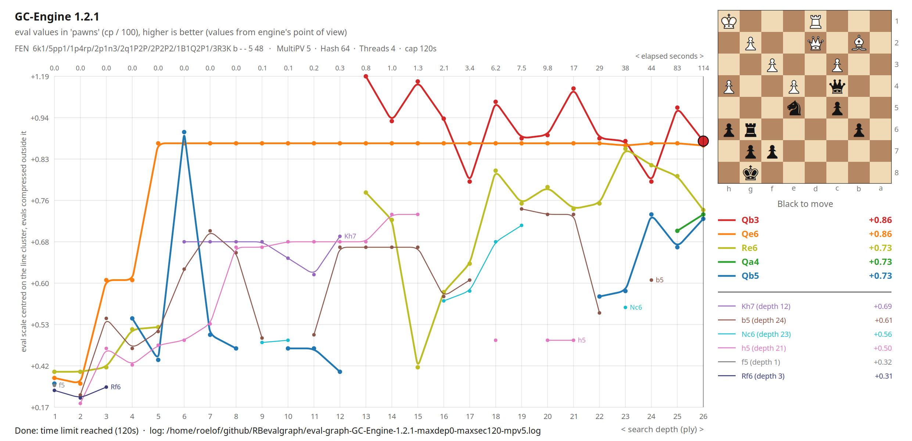
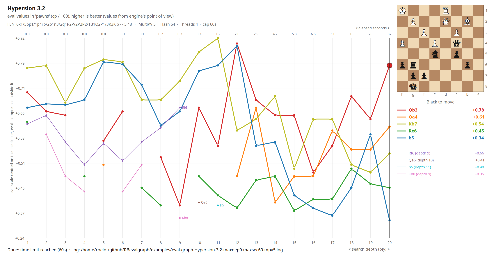

# RBevalgraph examples

Each example is a pair of files with the same name: the **PNG** is the graph as RBevalgraph saved it, the **log** is the complete UCI conversation between RBevalgraph and the engine during that search. Together they let you see the result and check exactly where every point in the graph came from.

The screencast below (about a minute, no sound) shows the search of example 2 as it happens: the settings at the top, the graph growing depth by depth, and the lines changing colour as the ranking changes. The engine path and FEN fields are cropped off; the engine name and the FEN are in the graph's header anyway. The same video is in this folder as `screencast-1360x850.mp4`.

https://github.com/user-attachments/assets/0fa3f159-252a-4239-9b1b-87f0c35aa87d

---

## How the files were made

Both files come straight from RBevalgraph v1.0, unedited except for one thing: in the log's header line, the engine's full path on the author's machine was shortened to the binary's name.

1. Choose the engine, paste the FEN, set MultiPV, max seconds, max depth, Hash and Threads.
2. Press **Generate eval graph** and let the search run until a limit is reached (or press **Stop**).
3. At the end of the search, RBevalgraph writes the **log** automatically.
4. Press **Save PNG** to write the **graph**. It is drawn by the same code as the window, at twice the resolution.

---

## How the file names are built

```
eval-graph-<engine>-maxdep<max depth>-maxsec<max seconds>-mpv<MultiPV>.png
eval-graph-<engine>-maxdep<max depth>-maxsec<max seconds>-mpv<MultiPV>.log
```

- `<engine>` is the name the engine reports about itself (`id name`), with spaces and other unusual characters replaced by `-`. So `GC-Engine 1.2.1` becomes `GC-Engine-1.2.1`.
- `maxdep0` means there was no depth limit: the search ran until the time limit.

The name only carries these four values. **It does not tell the position, Hash, Threads, or the date.** Two searches with the same engine and limits on different positions, or with a different Hash or Threads setting, get the same name — which is why an example that would clash gets a short extra tag at the end of both its files. The missing values are in two places:

- in the **PNG**, in the third header line: the FEN, MultiPV, Hash, Threads and the time cap;
- in the **log**, in its `#` header lines at the top, and in the `setoption` and `position` commands that follow.

---

## Reading the graph

The explanations below refer to the two example graphs further down this page.

### The horizontal axis: depth, with elapsed seconds on top

The axis runs by **search depth**, one step per depth. The small numbers along the top say **how many seconds had passed when that depth was complete** — that is, when the engine had reported that depth for every one of the MultiPV candidates.

Because every depth gets the same width, the seconds are **not** spread evenly. Each deeper iteration takes longer than the one before — in example 1, depth 13 is done after 0.8 seconds, depth 26 after 114. So the time scale is strongly compressed to the right: the last few steps of the axis cover most of the search time. When the numbers would overlap, some are left out.

**Why does the last number not match the time limit?** In example 1 the limit was 120 seconds, but the last number is 114. The engine did search for the full 120 seconds: depth 26 was complete at 114.4 seconds, then it started on depth 27 and had not finished a single candidate of it when RBevalgraph stopped it at 120 seconds. An unfinished depth reports nothing, so the graph ends at the last depth that produced data. You can see it at the end of the log: the last `info depth 26 … multipv 5 … time 114425` line, then `> stop` and the engine's `bestmove`.

### The vertical axis: evaluation, compressed outside the cluster

Evaluations are in pawns (the engine's centipawns / 100), from the engine's point of view: higher is better for the side to move.

Most candidates usually sit close together, while a single line can wander far off. A plain linear axis would squeeze that cluster into a thin band. So RBevalgraph centres the axis on the cluster of lines, keeps it **linear near the cluster**, and **compresses it further out** (logarithmic). The note along the left side of the axis says so whenever this is active.

The grid lines are evenly spaced on screen, but their values are not: in example 1 the steps near the middle are 0.07 to 0.08, the outer steps 0.25. The labels always show the real values, so read a point's value from the labels, not by measuring distances.

### The colours: ranking, not identity

A colour belongs to a **place in the ranking**, not to a move:

| Place | Colour |
|---|---|
| 1 | red |
| 2 | orange |
| 3 | dark yellow |
| 4 | green |
| 5 | blue |
| 6 and further | purple, brown, light blue, pink, grey, indigo, … |

While the search runs, the ranking is updated at every completed depth, and the lines are recoloured with it: when a move overtakes another, the two swap colours. So in the live window the red line is always the engine's current first choice.

The saved PNG shows the **final** ranking — the order at the last complete depth — and each move's whole line is drawn in the colour of its final place. So the red line in a PNG is the move ranked first at the end, even at depths where it was not first yet.

Below the separator in the key column are the moves that were in the MultiPV list at some point but dropped out. They are drawn thinner, ranked by the last value they had, and `(depth n)` tells at which depth they were last seen. Their names are also printed at the end of their line in the graph.

The big dot with the black ring marks the engine's `bestmove`. Two moves with exactly the same value keep the engine's own order.

---

## Example 1 — GC-Engine 1.2.1, Black to move, 120 seconds

`eval-graph-GC-Engine-1.2.1-maxdep0-maxsec120-mpv5.png` · `.log`

| | |
|---|---|
| FEN | `6k1/5pp1/1p4rp/2p1n3/2q1P2P/2P2P2/1B1Q2P1/3R3K b - - 5 48` |
| Settings | MultiPV 5 · Hash 64 · Threads 4 · 120 seconds · no depth limit |
| Reached | depth 26 after 114 seconds |
| Best move | Qb3 (`c4b3`), +0.86 |

[](eval-graph-GC-Engine-1.2.1-maxdep0-maxsec120-mpv5.png)

Things to notice:

- **Qe6** (orange) is at +0.86 from depth 5 onwards and does not change at all, while **Qb3** (red) only appears at depth 13 and swings between +0.79 and +1.19. At depth 26 both are +0.86; the engine lists Qb3 first, and it becomes the `bestmove`.
- **Qb5** (blue) jumps to +0.89 at depth 6, is missing at depth 9, drops out of the list after depth 12, and comes back from depth 22.
- **Qa4** (green) only enters the top five at depth 25.
- **Kh7** was a candidate up to depth 12 and was dropped after that; **b5**, **Nc6** and **h5** held on much longer before falling out.

---

## Example 2 — Hypersion 3.2, same position, 60 seconds

`eval-graph-Hypersion-3.2-maxdep0-maxsec60-mpv5.png` · `.log` · and the screencast shown at the top of this page

| | |
|---|---|
| FEN | `6k1/5pp1/1p4rp/2p1n3/2q1P2P/2P2P2/1B1Q2P1/3R3K b - - 5 48` (as example 1) |
| Settings | MultiPV 5 · Hash 64 · Threads 4 · 60 seconds · no depth limit |
| Reached | depth 20 after 37 seconds |
| Best move | Qb3 (`c4b3`), +0.78 |

[](eval-graph-Hypersion-3.2-maxdep0-maxsec60-mpv5.png)

Things to notice:

- **The time limit and the last depth.** Depth 20 was complete at 37.4 seconds. The engine then worked on depth 21 for the remaining 22.6 seconds without finishing a single candidate, so the graph ends at depth 20 — a much bigger gap than in example 1, and a good illustration of how each depth costs more than the one before.
- **Both engines choose Qb3**, but by different routes. Here **Kh7** (dark yellow) is the engine's first line from depth 1 to 9 and peaks at +0.92 at depth 11. **Qb3** (red) becomes the engine's first line from depth 13 on and ends clearly on top, at +0.78.
- **The engine does not list its lines in value order.** At depth 20 the log reports Kh7 (+0.54) as line 2 and Qa4 (+0.61) as line 3. RBevalgraph ranks by value, so Qa4 (orange) is placed above Kh7 — which is why the graph's order can differ from the engine's own numbering.
- **b5** (blue) shares the lead at +0.88 at depth 12, then falls and ends last of the five, at +0.34.
- Four moves left the list along the way: **Rf6** and **Kh8** after depth 9, **Qa6** after depth 10 and **h5** after depth 11.
